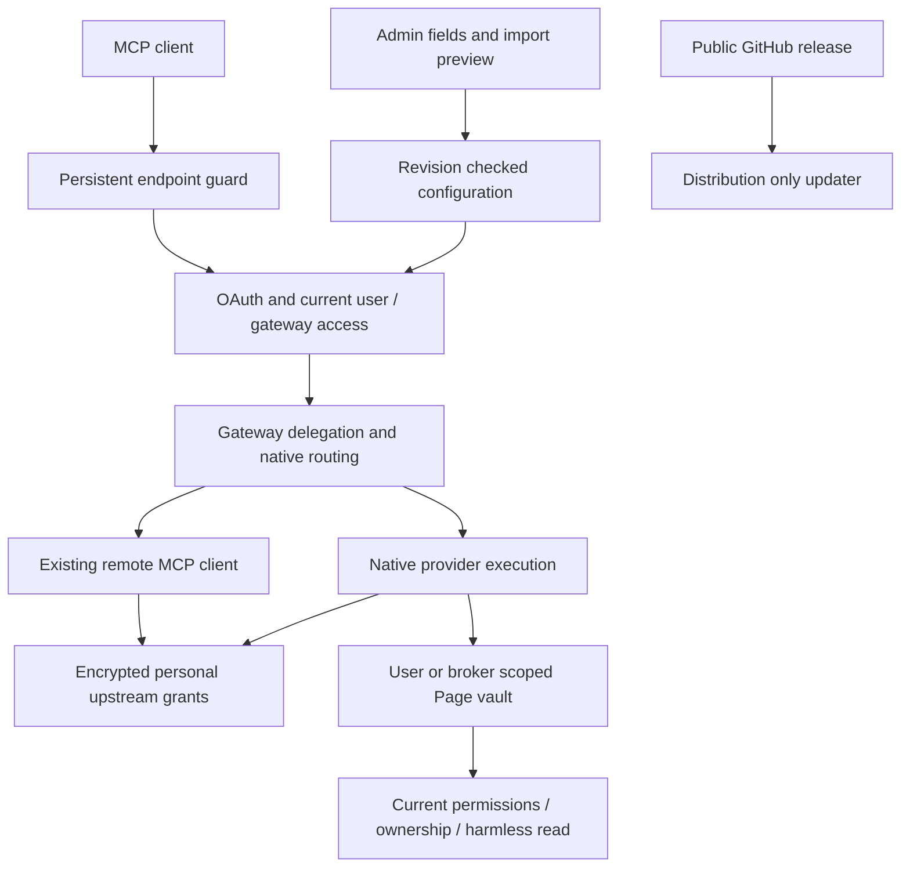

# Architecture and Graphify

The runtime loads reviewed compatibility seams before GetMCP initializes. Authored modules remain readable under `includes/`; admin components under `admin/` reuse native UI services. Bootstrap validates known dependency hashes, detects native feature ownership and fails closed for conflicting builds.

## Code map

Run `python tools/graph.py` with Graphify installed. The map uses local code AST extraction only and makes no model/API request. It excludes vendor dependencies, generated compatibility/build assets, fixture data and portable templates. This keeps the map focused on authored backend/admin relationships.

Outputs under `graphify-out/` include graph.json, GRAPH_REPORT.md and an interactive graph.html. Paths are repository-relative. Query with `graphify query "How are personal tokens isolated?"` or trace `graphify path "ProviderConnections" "PageTokens"`. Exact node labels depend on AST extraction; use graphify explain or search the graph vocabulary first. Do not invent relationships absent from the map.

No semantic documentation extraction, automated LLM community naming or background hook is enabled. Documentation lives beside the code. Rebuild the map after authored code changes and review differences before committing. Generated graph files never enter the installed release ZIP.
